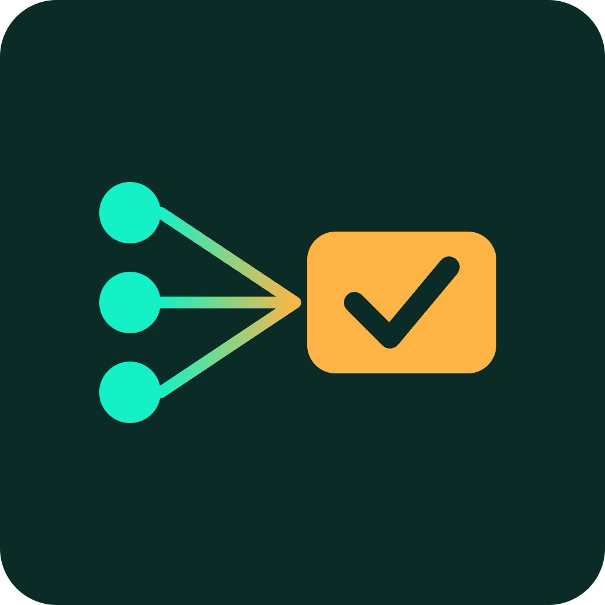

# SolDecode


*An open-source Go SDK that turns raw Solana instructions into meaningful actions.*

## Overview

SolDecode is an open-source Go SDK and API that decodes raw Solana instructions and program logs into structured, semantic actions, such as "swapped 2 SOL for 150 USDC." It gives developers building on-chain tools a reusable foundation instead of reimplementing parsing for every program.

## Problem

Every Solana dev team ends up writing their own fragile instruction parser because there is no shared, well-tested library for semantic decoding across common programs. The result is duplicated effort and inconsistent, brittle results across the ecosystem.

## Solution

SolDecode provides a Go library with pluggable decoders per program (System, Token, Jupiter, Orca, Marinade, and more), exposed both as a native Go package and as a REST/gRPC API for non-Go consumers. New decoders can be added through a plugin architecture without touching core logic.

## Features (MVP)

- Core Go SDK with a decoder registry for common Solana programs
- REST API endpoint: paste a tx signature or wallet address, get back structured JSON events
- Plugin architecture so new program decoders can be added without touching core logic
- CLI tool for quick local decoding and debugging of raw transactions
- Example integration showing a minimal web dashboard built on top of the SDK

## Tech Stack

Go, Solana RPC API, Anchor IDL/Borsh decoding, gRPC, REST, Docker

## How It Works

```
[ Tx signature / wallet address ]
            |
            v
     Solana RPC API  --->  raw instructions & logs
            |
            v
     Decoder Registry (plugin-based)
   [ System | Token | Jupiter | Orca | Marinade | ... ]
            |
            v
   Structured semantic JSON event
   (e.g. "swapped 2 SOL for 150 USDC")
            |
            v
   Go package / REST / gRPC / CLI
```

Clients can consume SolDecode directly as a Go package, or over REST/gRPC if they are not using Go. The CLI wraps the same core library for local debugging.

## Roadmap

- Grow decoder coverage via community contributions and a program registry
- Publish as a Go module and hosted API with usage-based pricing
- Partner with wallets and explorers to adopt SolDecode as their parsing backend

## Pitch

- Slides: [docs/pitch.pdf](docs/pitch.pdf)
- Spoken script: [docs/pitch-script.md](docs/pitch-script.md)

## Team

- Name / role: _TBD_
- Name / role: _TBD_
- Contact: _TBD_

Built for the Colosseum hackathon (Solana and other chains).

---

🎬 Pitch video: [docs/pitch-video.mp4](docs/pitch-video.mp4)


## Prototype

Live prototype: https://tomsyoya.github.io/soldecode/

The source is [docs/index.html](docs/index.html) (served with GitHub Pages from the /docs folder). All data is simulated.

🎥 Demo video: [docs/demo-video.mp4](docs/demo-video.mp4)
